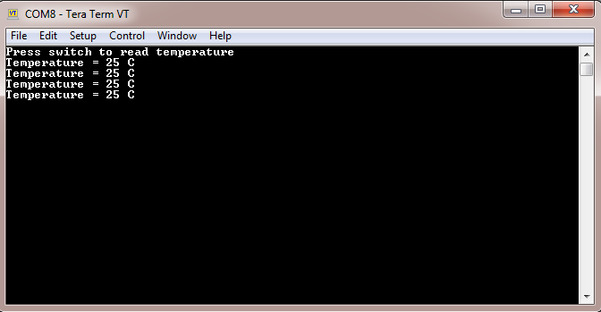

# I2C driver asynchronous - I2C Temp Sensor

This example application shows how to use the I2C driver in asynchronous mode to communicate with the MCP9808 I2C based temperature sensor.

## Description

This example uses the I2C driver in asynchronous mode to communicate with the MCP9808 I2C temperature sensor. The example application reads and prints the temperature value on a serial terminal whenever a user presses a switch on the development board.

## Downloading and building the application

To clone or download this application from Github, go to the [main page of this repository](https://github.com/Microchip-MPLAB-Harmony/core_apps_pic32mk) and then click Clone button to clone this repository or download as zip file.
This content can also be downloaded using content manager by following these [instructions](https://github.com/Microchip-MPLAB-Harmony/contentmanager/wiki).

Path of the application within the repository is **apps/driver/i2c/async/i2c_temp_sensor/firmware** .

To build the application, refer to the following table and open the project using its IDE.

| Project Name      | Description                                    |
| ----------------- | ---------------------------------------------- |
| pic32mk_mcj_curiosity_pro.X | MPLABX project for PIC32MK MCJ Curiosity Pro Board |
|||

## Setting up the hardware

The following table shows the target hardware for the application projects.

| Project Name| Board|
|:---------|:---------:|
| pic32mk_mcj_curiosity_pro.X | PIC32MK MCJ Curiosity Pro Board |
|||

### Setting up PIC32MK MCJ Curiosity Pro Board

- Connect micro USB cable to the 'Debug USB' connector(J1) on the board to the computer
- This will enumerate as a COM port on the PC

## Running the Application

1. Open the Terminal application (Ex.:Tera term) on the computer
2. Connect to the EDBG Virtual COM port and configure the serial settings as follows:
    - Baud : 115200
    - Data : 8 Bits
    - Parity : None
    - Stop : 1 Bit
    - Flow Control : None
3. Build and Program the application using its IDE
4. Press the User Switch to read and print the temperature value on the serial terminal. The temperature values will be displayed on the terminal as shown below:

    

Refer to the following table for Switch name:

| Board | Switch Name |
| ----- | -------- |
|  PIC32MK MCJ Curiosity Pro Board | SW200 |
|||
