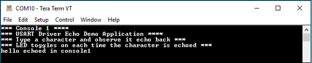
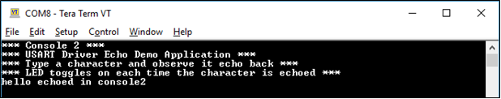

# USART driver asynchronous - USART multi instance

This example echoes the received characters over the two consoles using the USART driver in asynchronous mode

## Description

This example uses the USART driver in asynchronous mode in both Bare-Metal and RTOS environments to communicate over two consoles. It receives and echoes back the characters entered by the user on the respective console.

## Downloading and building the application

To clone or download this application from Github, go to the [main page of this repository](https://github.com/Microchip-MPLAB-Harmony/core_apps_pic32mk) and then click Clone button to clone this repository or download as zip file.
This content can also be downloaded using content manager by following these [instructions](https://github.com/Microchip-MPLAB-Harmony/contentmanager/wiki).

Path of the application within the repository is **apps/driver/usart/async/usart_multi_instance/firmware** .

To build the application, refer to the following table and open the project using its IDE.

| Project Name      | Description                                    |
| ----------------- | ---------------------------------------------- |
| pic32mk_gp_db.X | MPLABX project for [PIC32MK GP Development Kit](https://www.microchip.com/developmenttools/ProductDetails/dm320106) |
| pic32mk_mca_curiosity_pro.X | MPLABX project for [PIC32MK MCA Curiosity Pro Board](https://www.microchip.com/en-us/development-tool/EV15D86A) |
|||

## Setting up the hardware

The following table shows the target hardware for the application projects.

| Project Name| Board|
|:---------|:---------:|
| pic32mk_gp_db.X | [PIC32MK GP Development Kit](https://www.microchip.com/developmenttools/ProductDetails/dm320106) |
| pic32mk_mca_curiosity_pro.X | [PIC32MK MCA Curiosity Pro Board](https://www.microchip.com/en-us/development-tool/EV15D86A) |
|||

- To run the demo, the following additional hardware are required:
    - [USB UART click](https://www.mikroe.com/usb-uart-click) board

### Setting up [PIC32MK GP Development Kit](https://www.microchip.com/developmenttools/ProductDetails/dm320106)

- Connect micro USB cable to the 'Debug USB' connector(J12) on the board to the computer
- Connect a micro USB cable to the USART-USB port J25. This will enumerate the first COM port
- Install an [USB UART click](https://www.mikroe.com/usb-uart-click) board on to the mikroBUS socket J1
- Connect mini USB cable to the [USB UART click](https://www.mikroe.com/usb-uart-click) board. This will enumerate the second COM port

### Setting up [PIC32MK MCA Curiosity Pro Board](https://www.microchip.com/en-us/development-tool/EV15D86A)

- Connect micro USB cable to the 'Debug USB' connector(J1) on the board to the computer. This will enumerate as first COM port on the PC
- Install an [USB UART click](https://www.mikroe.com/usb-uart-click) board on to the mikroBUS socket
- Connect mini USB cable to the [USB UART click](https://www.mikroe.com/usb-uart-click) board. This will enumerate the second COM port

## Running the Application

1. Open the Terminal application (Ex.:Tera term) on the computer
2. Connect to the EDBG Virtual COM port and configure the serial settings as follows:
    - Baud : 115200
    - Data : 8 Bits
    - Parity : None
    - Stop : 1 Bit
    - Flow Control : None
3. Build and Program the application using its IDE
4. Type a character and observe the output on the two consoles as shown below:
    - If success the character typed echoes back and an LED toggles on each time the character is echoed
    - **Console 1**

    

    - **Console 2**

    

Refer to the following table for LED name:

| Board | LED Name |
| ----- | -------- |
|  [PIC32MK GP Development Kit](https://www.microchip.com/developmenttools/ProductDetails/dm320106) | LED1 |
|  [PIC32MK MCA Curiosity Pro Board](https://www.microchip.com/en-us/development-tool/EV15D86A) | LED1 |
|||
