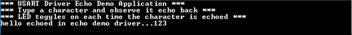

# USART driver synchronous - USART echo

This example echoes the received characters over the console using the USART driver in synchronous mode.

## Description

This example uses the USART driver in synchronous mode in Bare-Metal environment to communicate over the console. It receives and echo's back the characters entered by the user.

## Downloading and building the application

To clone or download this application from Github, go to the [main page of this repository](https://github.com/Microchip-MPLAB-Harmony/core_apps_pic32mk) and then click Clone button to clone this repository or download as zip file.
This content can also be downloaded using content manager by following these [instructions](https://github.com/Microchip-MPLAB-Harmony/contentmanager/wiki).

Path of the application within the repository is **apps/driver/usart/sync/usart_echo/firmware** .

To build the application, refer to the following table and open the project using its IDE.

| Project Name      | Description                                    |
| ----------------- | ---------------------------------------------- |
| pic32mk_mcj_curiosity_pro_freertos.X | MPLABX project for PIC32MK MCJ Curiosity Pro Board |
| pic32mk_mcm_curiosity_pro_freertos.X | MPLABX project for PIC32MK MCM Curiosity Pro Board |
| pic32mk_mca_curiosity_pro_freertos.X | MPLABX project for PIC32MK MCA Curiosity Pro Board |
|||

## Setting up the hardware

The following table shows the target hardware for the application projects.

| Project Name| Board|
|:---------|:---------:|
| pic32mk_mcm_curiosity_pro_freertos.X | PIC32MK MCM Curiosity Pro Board |
| pic32mk_mcj_curiosity_pro_freertos.X | PIC32MK MCJ Curiosity Pro Board |
| pic32mk_mca_curiosity_pro_freertos.X | PIC32MK MCA Curiosity Pro Board |
|||

### Setting up PIC32MK MCJ Curiosity Pro Board

- Connect micro USB cable to the 'Debug USB' connector(J1) on the board to the computer. This will enumerate as a COM port on the PC

### Setting up PIC32MK MCM Curiosity Pro Board

- Connect a micro USB cable to the USB DEBUG port J500
- Connect a micro USB cable to the USB to UART port J400. This will enumerate as a COM port on the PC

### Setting up PIC32MK MCA Curiosity Pro Board

- Connect micro USB cable to the 'Debug USB' connector(J1) on the board to the computer. This will enumerate as a COM port on the PC

## Running the Application

1. Open the Terminal application (Ex.:Tera term) on the computer
2. Connect to the EDBG Virtual COM port and configure the serial settings as follows:
    - Baud : 115200
    - Data : 8 Bits
    - Parity : None
    - Stop : 1 Bit
    - Flow Control : None
3. Build and Program the application using its IDE
4. Type a character and observe the output on the console as shown below:

    

5. LED toggles each time the character is echoed

Refer to the following table for LED name:

| Board | LED Name |
| ----- | -------- |
|  PIC32MK MCJ Curiosity Pro Board | LED2 |
|  PIC32MK MCM Curiosity Pro Board | LED2 |
|  PIC32MK MCA Curiosity Pro Board | LED1 |
|||
